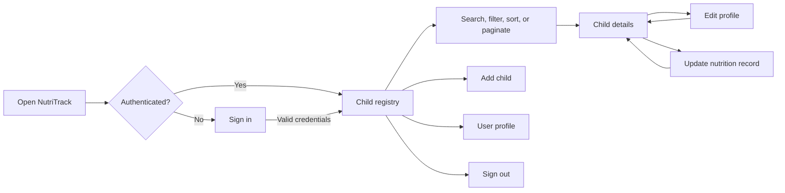

# Welcome to your Expo app 👋

<div align="center">


# NutriTrack

### Child nutrition monitoring for community health teams

<p>NutriTrack is a mobile-first Expo and React Native application for recording, reviewing, and maintaining child nutrition data within a barangay-based workflow.</p>


</div>

## Overview

NutriTrack gives authorized users a single place to manage child profiles and follow growth-related nutrition indicators. The app connects to a Laravel REST API, scopes the child list to the signed-in user's barangay, and keeps the day-to-day workflow focused: find a child, review their record, update measurements or interventions, and return to a refreshed list.

It is designed for field and community workflows where consistent records, clear status labels, and location-aware data matter.

## What The App Does

| Area                 | Functionality                                                                                                               |
| -------------------- | --------------------------------------------------------------------------------------------------------------------------- |
| Authentication       | Username and password sign-in, persisted sessions, logout, API error feedback, and session-expiration handling              |
| Child registry       | Browse children assigned to the user's barangay with server-side search, pagination, sorting, and archive filtering support |
| Nutrition indicators | Display Weight for Height (WFH), Weight for Age (WFA), and Height for Age (HFA) classifications                             |
| Child profiles       | View identity, birthdate, sex, height, weight, location, caregiver, health conditions, interventions, and profile image     |
| Child intake         | Create a child record with required validation for name, birthdate, sex, height, and weight                                 |
| Record maintenance   | Edit identity and profile information, update measurements, and assign health conditions or interventions                   |
| Reference data       | Load health conditions, intervention options, name extensions, sex values, and geographic information from the API          |
| User profile         | View the signed-in user's name, role, username, email, address, and birthdate                                               |

## User Workflow



## Growth Statuses

The registry and detail screens present API-provided classifications using readable labels and visual status treatments:

- **Weight for Height (WFH):** severely acute, moderately wasted, normal, overweight, or obese
- **Weight for Age (WFA):** severely underweight, underweight, or normal
- **Height for Age (HFA):** severely stunted, stunted, normal, or tall
- **Fallback handling:** missing or API error values are presented as `Unknown` or `Out of Range` where appropriate

These labels are displayed from the backend's classification data. The mobile client does not replace the server's nutrition assessment logic.

## Technical Architecture

```text
React Native screens (Expo Router)
					|
					v
AuthContext + AsyncStorage session
					|
					v
Typed API client (lib/api.ts)
					|
					v
Laravel REST API
					|
					v
Nutrition and child data store
```

### Main application areas

```text
app/
	index.tsx                    Session-aware entry redirect
	login.tsx                    Sign-in screen
	(children)/
		child-list.tsx             Searchable child registry
		add-child.tsx              New child intake form
		child-details.tsx          Child summary and nutrition statuses
		edit-child.tsx             Profile information editor
		update-child.tsx           Measurements and intervention update form
		profile-setting.tsx        Signed-in user profile
contexts/AuthContext.tsx       Authentication and session state
lib/api.ts                     Laravel API requests and domain types
assets/images/                 Branding, login, and profile imagery
```

## Technology Stack

- **Framework:** Expo SDK 54 with React Native 0.81
- **Language:** TypeScript 5.9
- **Navigation:** Expo Router with file-based routes
- **Authentication state:** React Context and AsyncStorage
- **Networking:** Fetch-based Laravel API client with bearer tokens
- **Media:** Expo Image, Expo Image Picker, and Expo File System
- **UI:** React Native components, Expo Linear Gradient, Ionicons, safe-area support, and date pickers
- **Delivery:** EAS Build, EAS Update, and EAS Workflows
- **Supported targets:** Android, iOS, and React Native Web

## Getting Started

### Prerequisites

- Node.js LTS and npm
- Android Studio and an Android emulator for local Android builds, or an iOS development environment for iOS builds
- Access to the NutriTrack Laravel API
- An account accepted by the API's `/api/login` endpoint

### Installation

```bash
git clone <your-repository-url>
cd nutri-track-8nV8bV
npm install
```

### Configure the API

Create a `.env` file in the project root:

```env
EXPO_PUBLIC_API_URL=http://localhost:8002
```

For a physical device, `localhost` must be replaced with an address reachable from that device, such as the development machine's local network IP. The app currently falls back to the configured remote API URL in `lib/api.ts` when `EXPO_PUBLIC_API_URL` is not provided, but setting the variable explicitly is recommended for each environment.

Optional image upload configuration:

```env
EXPO_PUBLIC_FTP_BASE_PATH=ftp://your-host/public/assets/images/child_profile/
```

Do not commit credentials, private FTP details, or production secrets to the repository.

### Run the app

```bash
npm run start
```

Then choose a target from the Expo CLI. Other useful commands are:

```bash
npm run android       # Run the Android app locally
npm run ios           # Run the iOS app locally
npm run web           # Run the web target
npm run lint          # Check the project with Expo ESLint
```

## API Contract

The client expects a Laravel API with bearer-token authentication and the following routes:

| Method | Endpoint                    | Purpose                                                                         |
| ------ | --------------------------- | ------------------------------------------------------------------------------- |
| `POST` | `/api/login`                | Authenticate a user and return a token plus user data                           |
| `POST` | `/api/logout`               | Invalidate the current token                                                    |
| `GET`  | `/api/user`                 | Retrieve the authenticated user                                                 |
| `GET`  | `/api/children`             | List children with search, pagination, location, status, and sorting parameters |
| `GET`  | `/api/children/{id}`        | Retrieve one child and related data                                             |
| `POST` | `/api/children`             | Create a child record                                                           |
| `POST` | `/api/children/{id}`        | Update child profile data                                                       |
| `POST` | `/api/children/{id}/update` | Record updated measurements, conditions, and interventions                      |
| `GET`  | `/api/health-conditions`    | Load available health conditions                                                |
| `GET`  | `/api/interventions`        | Load available interventions                                                    |
| `GET`  | `/api/name-extensions`      | Load name-extension choices                                                     |

The exact write endpoint behavior is defined by the connected backend. Keep the mobile client and Laravel API versioned together when changing request or response shapes.

## EAS Workflows

The project includes build profiles for development, simulator, preview, and production in [`eas.json`](./eas.json), plus npm shortcuts for the configured workflows:

```bash
npm run development-builds  # Build an internal development client
npm run draft               # Publish a preview update
npm run deploy              # Run the production deployment workflow
```

For store-ready builds, configure the required Expo and Apple/Google credentials before running EAS commands. See the [Expo deployment documentation](https://docs.expo.dev/deploy/build-project/) for current requirements.

## Security And Data Notes

- Access tokens are stored locally with AsyncStorage and sent as bearer tokens to protected API routes.
- Child records are requested using the authenticated user's barangay context.
- A token invalidated by another login is detected and the user is prompted to sign in again.
- This repository contains a client application, not the Laravel backend or its database.
- Nutrition classifications should be interpreted by qualified health personnel and according to the rules implemented by the backend.
- Use HTTPS and environment-specific API configuration for deployed environments.

## Project Status

NutriTrack is an active application client with the core authentication, child registry, profile, nutrition-status, and record-maintenance flows implemented. Backend availability, API permissions, reference data, image hosting, and production credentials are required for a complete end-to-end deployment.

## Documentation

- [Expo documentation](https://docs.expo.dev/)
- [Expo Router](https://docs.expo.dev/router/introduction/)
- [Expo environment variables](https://docs.expo.dev/guides/environment-variables/)
- [EAS Build](https://docs.expo.dev/build/introduction/)
- [React Native documentation](https://reactnative.dev/docs/getting-started)

## License

This project currently declares the `0BSD` license in `package.json`. Confirm that this matches the intended repository license before publishing a public release.

## Get started

To start the app, in your terminal run:

```bash
npm run start
```

In the output, you'll find options to open the app in:

- [a development build](https://docs.expo.dev/develop/development-builds/introduction/)
- [an Android emulator](https://docs.expo.dev/workflow/android-studio-emulator/)
- [an iOS simulator](https://docs.expo.dev/workflow/ios-simulator/)
- [Expo Go](https://expo.dev/go), a limited sandbox for trying out app development with Expo

You can start developing by editing the files inside the **app** directory. This project uses [file-based routing](https://docs.expo.dev/router/introduction).

## Workflows

This project is configured to use [EAS Workflows](https://docs.expo.dev/eas/workflows/get-started/) to automate some development and release processes. These commands are set up in [`package.json`](./package.json) and can be run using NPM scripts in your terminal.

### Previews

Run `npm run draft` to [publish a preview update](https://docs.expo.dev/eas/workflows/examples/publish-preview-update/) of your project, which can be viewed in Expo Go or in a development build.

### Development Builds

Run `npm run development-builds` to [create a development build](https://docs.expo.dev/eas/workflows/examples/create-development-builds/). Note - you'll need to follow the [Prerequisites](https://docs.expo.dev/eas/workflows/examples/create-development-builds/#prerequisites) to ensure you have the correct emulator setup on your machine.

### Production Deployments

Run `npm run deploy` to [deploy to production](https://docs.expo.dev/eas/workflows/examples/deploy-to-production/). Note - you'll need to follow the [Prerequisites](https://docs.expo.dev/eas/workflows/examples/deploy-to-production/#prerequisites) to ensure you're set up to submit to the Apple and Google stores.

## Hosting

Expo offers hosting for websites and API functions via EAS Hosting. See the [Getting Started](https://docs.expo.dev/eas/hosting/get-started/) guide to learn more.

## Get a fresh project

When you're ready, run:

```bash
npm run reset-project
```

This command will move the starter code to the **app-example** directory and create a blank **app** directory where you can start developing.

## Learn more

To learn more about developing your project with Expo, look at the following resources:

- [Expo documentation](https://docs.expo.dev/): Learn fundamentals, or go into advanced topics with our [guides](https://docs.expo.dev/guides).
- [Learn Expo tutorial](https://docs.expo.dev/tutorial/introduction/): Follow a step-by-step tutorial where you'll create a project that runs on Android, iOS, and the web.

## Join the community

Join our community of developers creating universal apps.

- [Expo on GitHub](https://github.com/expo/expo): View our open source platform and contribute.
- [Discord community](https://chat.expo.dev): Chat with Expo users and ask questions.
